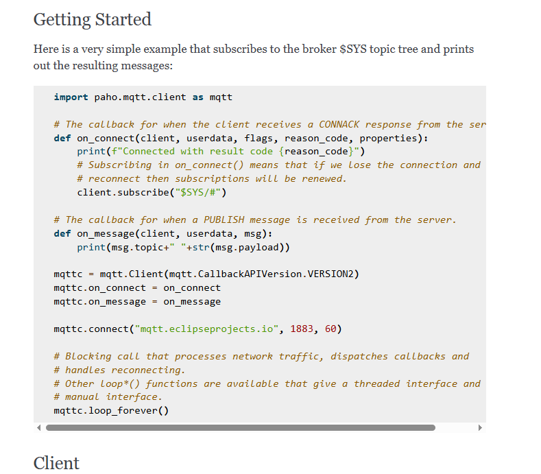

# Servicio-1

Este servicio debe simular un dispositivo electrónico que envía mensajes a una cola MQTT.
Al comenzar a funcionar, cada 1 minuto, debe publicar el siguiente mensaje en el tópico `challenge/dispositivo/rx` del servicio mqtt(mosquitto).

```json
{
    "time": datetime,
    "value": random(0, 1000),
    "version": random(1, 2) 
}
```
Donde **datetime** es la fecha y hora del momento de publicación, **value** es un número flotante aleatorio entre 0 y 100. **version** es un número entero aleatorio que solo puede ser 1 o 2 y representa la versión del dispositivo.

Ejemplo

```json
{
    "time": "2022-01-01 10:00:00",
    "value": 566.45,
    "version": 1
}
```
---

# Servicio-1 – Simulación de Dispositivo Publicador MQTT

Este servicio simula un dispositivo electrónico que publica datos cada 60 segundos a un **broker MQTT (Mosquitto)** en el tópico: `challenge/dispositivo/rx`

## Tecnologías utilizadas
- Python
- MQTT (protocolo)
- Mosquitto (broker)
- Librería `paho-mqtt`

## Recursos utilizados
- [Paho MQTT Python Client Docs](https://eclipse.dev/paho/files/paho.mqtt.python/html/index.html)
- [HiveMQ MQTT Essentials](https://www.hivemq.com/mqtt/)
- [Mosquitto Documentation](https://mosquitto.org/documentation/)

## Apoyo de Inteligencia Artificial (ChatGPT)
-Lo puede acceder en el archivo uso_IA.md

## Cómo ejecutar este servicio
-python servicio_1.py


## Dudas
-En este readme "value" tiene un valor random de 0 a 1000, ya en la descripción dice número flotante de 0 a 100, decidi hacerlo de 0 a 1000 por que el json de respuesta tiene un valor más grande que 100.

## Screenshoot 


- Ejemplo de como enviar mensajes con mosquitto
https://eclipse.dev/paho/files/paho.mqtt.python/html/index.html
