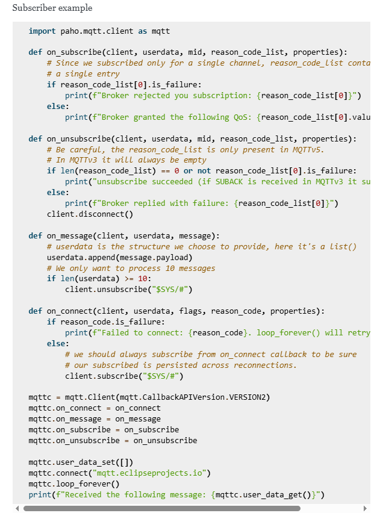
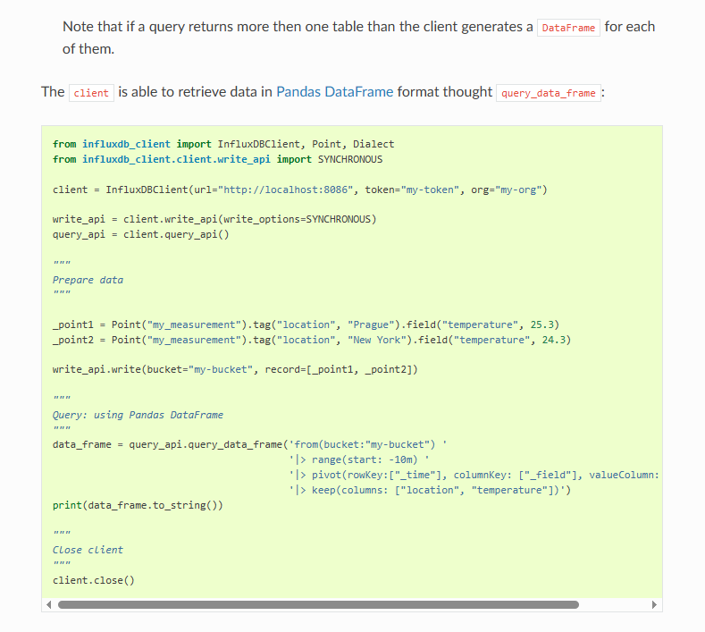

# Servicio-2

Este servicio debe escuchar el tópico `challenge/dispositivo/rx` del servicio mqtt(mosquitto).
Cada mensaje que llegue se debe insertar en el servicio influx, teniendo en consideración que el **time** y **value** son *fields* y **version** es un *tag*.
Este mensaje se guardará en el bucket **system** en el measurement **dispositivos**.

------------------------------------------------------------------------------------------------------------------------------------------------------------------------------------

# Servicio-2 – Suscriptor MQTT con escritura en InfluxDB

Este servicio escucha mensajes MQTT del tópico `challenge/dispositivo/rx` publicado por el **servicio-1**, y los guarda en **InfluxDB** como series temporales.

---

Para facilitar la revisión y testeo del desafío, no se aplicó la carga de credenciales a través de un archivo .env.
En su lugar, las credenciales sensibles como tokens de InfluxDB y datos de conexión a MySQL se encuentran directamente en el código.

En un entorno productivo o profesional, se recomienda el uso de variables de entorno externas y archivos .env (con soporte de librerías como python-dotenv o directamente gestionadas por el sistema) para proteger información sensible y seguir buenas prácticas de seguridad.

---

## ¿Qué hace este servicio?
- Se suscribe al tópico MQTT `challenge/dispositivo/rx`
- Por cada mensaje recibido:
  - Lo decodifica desde JSON
  - Inserta un punto en InfluxDB con:
    - `time` y `value` como **fields**
    - `version` como **tag**
- Guarda los datos en:
  - **Bucket**: `system`
  - **Measurement**: `dispositivos`

---

## Tecnologías utilizadas
- Python
- MQTT (paho-mqtt)
- InfluxDB v2
- Librería `influxdb-client`

---

## Recursos utilizados
- [Paho MQTT Python Client Docs](https://eclipse.dev/paho/files/paho.mqtt.python/html/index.html)
- [InfluxDB Python Client](https://influxdb-client.readthedocs.io/en/latest/)
- [Influx Line Protocol & Tags](https://docs.influxdata.com/influxdb/v2.7/reference/syntax/line-protocol/)

---

## Apoyo de Inteligencia Artificial (ChatGPT)
-Lo puede acceder en el archivo uso_IA.md

---

## Reflexión personal
Este servicio me permitió reforzar el uso del patrón **pub/sub**, y aplicar la escritura de datos estructurados en una base de series temporales.

Pude entender:
- Cómo funciona `on_message()` para capturar mensajes en tiempo real
- La estructura de Influx (bucket, measurement, fields, tags)
- Cómo transformar un mensaje JSON en un punto válido para InfluxDB

Todo el flujo fue validado y comprendido en profundidad. Estoy en condiciones de extender este servicio o adaptarlo a otros escenarios similares.

---

## Cómo ejecutar este servicio

1. Asegurarse de que:
   - Mosquitto está activo
   - InfluxDB está corriendo y configurado con bucket `system`
   - El token y URL están bien configurados en el script

2. Ejecutar el script:

```bash
python servicio_2.py
```

---

## Comentarios
- El token decidi dejarlo en blanco ya que es único por computador.


## Screenshoot


- Ejemplo de como recibir mensajes con mosquitto
https://eclipse.dev/paho/files/paho.mqtt.python/html/index.html



- Ejemplo de como establecer conexión con InfluxDB
https://influxdb-client.readthedocs.io/en/latest/usage.html