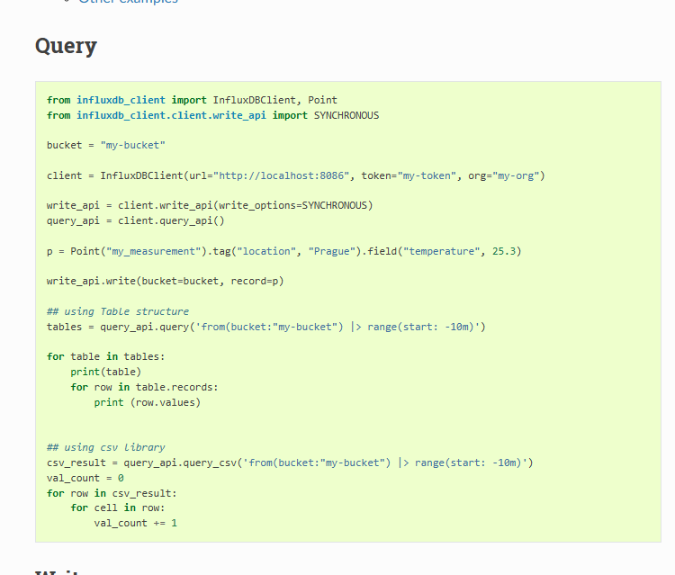
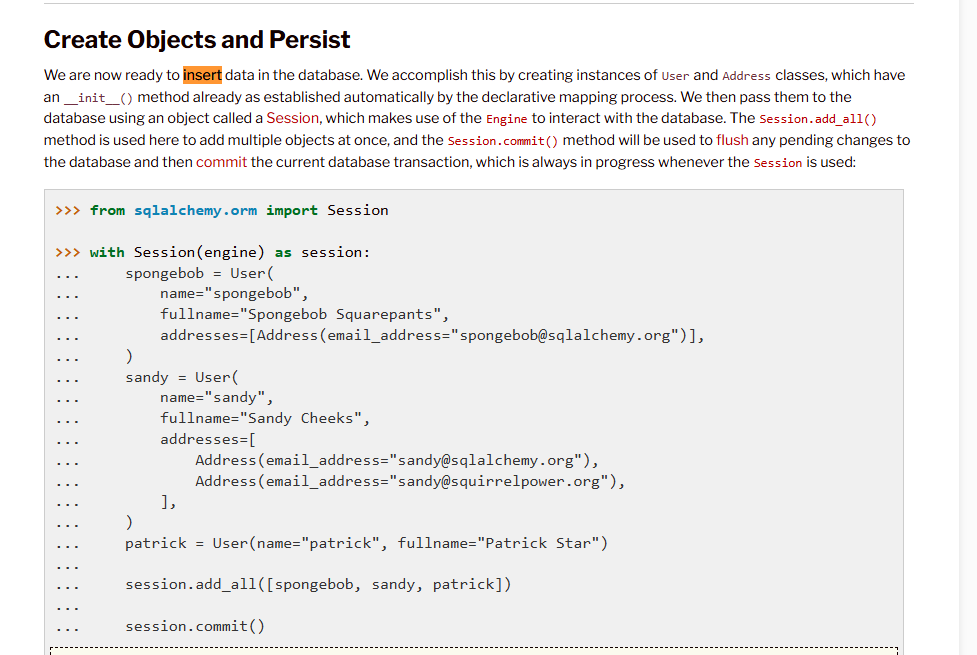
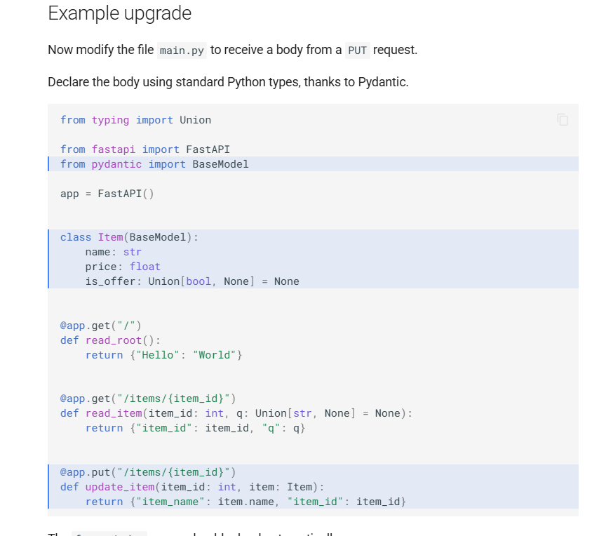

# Servicio-3

Este servicio expone una API con 3 endpoints los cuales harán diferentes
cosas de acuerdo a lo siguiente.

## POST challenge/process

Este endpoint va a procesar todos los mensajes que hayan llegado a **influx**, al bucket **system**, measurement **dispositivos**, que sean de cierta versión en el tiempo especificado. La versión puede ser 1 o 2 y el tiempo de busqueda es un string conteniendo un numero y una letra. Las letras posibles son *m, h, d* correspondientes a minutos, horas y días respectivamente, Ej: *15m, 3h, 2d*.
El procesamiento consiste en revisar los puntos e ir insertandolos en la tabla **alerts** del servicio **mysql** de acuerdo a lo siguiente:

- Si la versión es 1

  - Si el valor es mayor a 200 es una alerta de tipo BAJA
  - Si el valor es mayor a 500 es una alerta MEDIA
  - Si el valor es mayor a 800 es una alerta ALTA

- Si la versión es 2

  - Si el valor es menor a 200 es una alerta de tipo ALTA
  - Si el valor es menor a 500 es una alerta MEDIA
  - Si el valor es menor a 800 es una alerta BAJA

La tabla **alertas** debe tener las siguientes columnas:

- id_alerta: int,
- datetime: datetime,
- value: float,
- version: int,
- type: enumerate[BAJA, MEDIA, ALTA],
- sended: bool,
- created_at: datetime,
- updated_at: datetime

### Request

```json
{
    "version": number,
    "timeSearch": string
}
```

### Reponses

- 200 `{"status": "ok"}`
- 422 `{"status": "No se pudo procesar los párametros"}`
- 500 `{"status": "Error: {motivo}"}`

## POST challenge/search

Este endpoint busca y muestra todas las alertas de acuerdo a los filtros
solicitados.

En el caso de que se omitan uno o ambos opcionales se entiende que se deben mostrar todos.

### Request

```json
{
    "version": number,
    "type": string, // opcional
    "sended": bool // opcional
}
```

### Reponse

- 200
    ```json
    [
        {
            datetime: "2022-01-01 10:00:01",
            value: 566.45,
            version: 1,
            type: "MEDIA",
            sended: false
        }, ...
    ]
    ```
- 422 `{"status": "No se pudo procesar los párametros"}`
- 500 `{"status": "Error: {motivo}"}`

## POST challenge/send

Este endpoint busca y envía todas las alertas que no hayan sido
enviadas de acuerdo a los filtros solicitados.

Lo único que tiene que hacer para simular el envío es actualizar el campo **sended** de *false* a *true*

### Request

```json
{
    "version": number,
    "type": string
}
```

### Reponse

- 200 `{"status": "ok"}`
- 422 `{"status": "No se pudo procesar los párametros"}`
- 500 `{"status": "Error: {motivo}"}`

-----------------------------------------------------------------------------------------------------------------------------------------------------------------------------------

# Servicio-3 – API REST para procesamiento de alertas

Este servicio expone una API REST construida con **FastAPI** que se encarga de procesar los datos almacenados en InfluxDB, generar alertas con base en reglas de negocio, y almacenarlas en **MySQL**.  
Además, permite buscar y "enviar" alertas marcándolas como procesadas.

---

Fue aplicado un archivo .env para manejar credenciales sensibles (como tokens de InfluxDB o conexión a MySQL). 

---

## ¿Qué hace internamente?

- Lee desde **InfluxDB** usando `influxdb-client`
- Inserta alertas en **MySQL** usando `SQLAlchemy`
- Expone una API con **FastAPI**
- Define los modelos con `SQLAlchemy`
- Formatea la salida para el frontend (JSON)

---

## Tecnologías utilizadas

- FastAPI
- SQLAlchemy
- Pydantic
- InfluxDB Client
- MySQL
- Bootstrap 5 (frontend visual opcional)

---

## Recursos utilizados

- [FastAPI Docs](https://fastapi.tiangolo.com/)
- [SQLAlchemy ORM Docs](https://docs.sqlalchemy.org/en/20/orm/)
- [InfluxDB Python Client Docs](https://influxdb-client.readthedocs.io/)
- [MySQL Reference](https://dev.mysql.com/doc/)


---

## Reflexión personal
Este servicio me permitió integrar múltiples tecnologías y aplicar una arquitectura real de procesamiento de datos.
Comprendí el uso de:

Modelos en SQL y ORM

Lógica de negocio aplicada a datos dinámicos

Consumo cruzado entre Influx y MySQL

Exposición de servicios mediante APIs RESTful

Me apoyé en IA para optimizar ciertas partes del desarrollo, pero cada componente fue comprendido, validado y testeado por mí.

---

## Cómo probar

1. Asegurate de tener corriendo:
   - InfluxDB con bucket `system`
   - MySQL con tabla `alerts`
   - Servicio-1 y servicio-2 funcionando para generar datos

2. Ejecutá el servicio:

```bash
uvicorn main:app --reload
```

## Screenshoot


- Esto es un ejemplo de query para InfluxDB.
- https://influxdb-client.readthedocs.io/en/latest/usage.html#query



- Esto es un ejemplo de inserción con SQLAlchemy
- https://docs.sqlalchemy.org/en/20/orm/quickstart.html



- Esto es un ejemplo de creación de endpoints con FASTAPI
- https://fastapi.tiangolo.com/#example-upgrade

